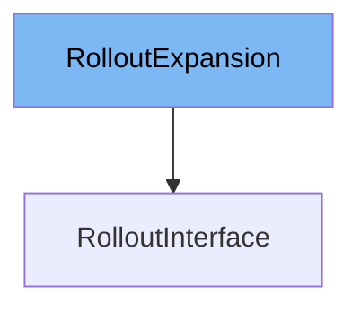

This document will cover the class <SwmToken path="pkg/client/clientset/versioned/typed/rollouts/v1alpha1/generated_expansion.go" pos="29:2:2" line-data="type RolloutExpansion interface{}">`RolloutExpansion`</SwmToken>. We will discuss:

1. What <SwmToken path="pkg/client/clientset/versioned/typed/rollouts/v1alpha1/generated_expansion.go" pos="29:2:2" line-data="type RolloutExpansion interface{}">`RolloutExpansion`</SwmToken> is.
2. The variables and functions defined in <SwmToken path="pkg/client/clientset/versioned/typed/rollouts/v1alpha1/generated_expansion.go" pos="29:2:2" line-data="type RolloutExpansion interface{}">`RolloutExpansion`</SwmToken>.
3. An example of how to use <SwmToken path="pkg/client/clientset/versioned/typed/rollouts/v1alpha1/generated_expansion.go" pos="29:2:2" line-data="type RolloutExpansion interface{}">`RolloutExpansion`</SwmToken> in <SwmToken path="pkg/client/clientset/versioned/typed/rollouts/v1alpha1/rollout.go" pos="33:16:16" line-data="// RolloutsGetter has a method to return a RolloutInterface.">`RolloutInterface`</SwmToken>.



# What is <SwmToken path="pkg/client/clientset/versioned/typed/rollouts/v1alpha1/generated_expansion.go" pos="29:2:2" line-data="type RolloutExpansion interface{}">`RolloutExpansion`</SwmToken>

<SwmToken path="pkg/client/clientset/versioned/typed/rollouts/v1alpha1/generated_expansion.go" pos="29:2:2" line-data="type RolloutExpansion interface{}">`RolloutExpansion`</SwmToken> is an interface defined in the file <SwmPath>[pkg/client/clientset/versioned/typed/rollouts/v1alpha1/generated_expansion.go](pkg/client/clientset/versioned/typed/rollouts/v1alpha1/generated_expansion.go)</SwmPath>. It is used as a placeholder for adding custom methods to the Rollout client in the Kubernetes <SwmToken path="pkg/client/clientset/versioned/typed/rollouts/v1alpha1/rollout.go" pos="30:8:10" line-data="	rest &quot;k8s.io/client-go/rest&quot;">`client-go`</SwmToken> library. This allows developers to extend the functionality of the Rollout client without modifying the generated code.

<SwmSnippet path="/pkg/client/clientset/versioned/typed/rollouts/v1alpha1/generated_expansion.go" line="29">

---

# Variables and functions

The <SwmToken path="pkg/client/clientset/versioned/typed/rollouts/v1alpha1/generated_expansion.go" pos="29:2:2" line-data="type RolloutExpansion interface{}">`RolloutExpansion`</SwmToken> interface is defined here. It does not contain any methods by default, but it can be extended with custom methods as needed.

```go
type RolloutExpansion interface{}
```

---

</SwmSnippet>

# Usage example

To use the <SwmToken path="pkg/client/clientset/versioned/typed/rollouts/v1alpha1/generated_expansion.go" pos="29:2:2" line-data="type RolloutExpansion interface{}">`RolloutExpansion`</SwmToken> interface, you would typically define custom methods in a separate file and then implement those methods in a struct that embeds the Rollout client. Here is an example of how you might extend the Rollout client with a custom method:

<SwmSnippet path="/pkg/client/clientset/versioned/typed/rollouts/v1alpha1/rollout.go" line="1">

---

In this file, you would define your custom methods for the Rollout client. For example, you might add a method to get the status of a rollout.

```go
/*
Copyright The Kubernetes Authors.

Licensed under the Apache License, Version 2.0 (the "License");
you may not use this file except in compliance with the License.
You may obtain a copy of the License at

    http://www.apache.org/licenses/LICENSE-2.0

Unless required by applicable law or agreed to in writing, software
distributed under the License is distributed on an "AS IS" BASIS,
WITHOUT WARRANTIES OR CONDITIONS OF ANY KIND, either express or implied.
See the License for the specific language governing permissions and
limitations under the License.
*/
```

---

</SwmSnippet>

&nbsp;

*This is an auto-generated document by Swimm 🌊 and has not yet been verified by a human*

<SwmMeta version="3.0.0" repo-id="Z2l0aHViJTNBJTNBaW50dWl0LWFyZ28tcm9sbG91dHMtZGVtbyUzQSUzQVN3aW1tLURlbW8=" repo-name="intuit-argo-rollouts-demo"><sup>Powered by [Swimm](/)</sup></SwmMeta>
