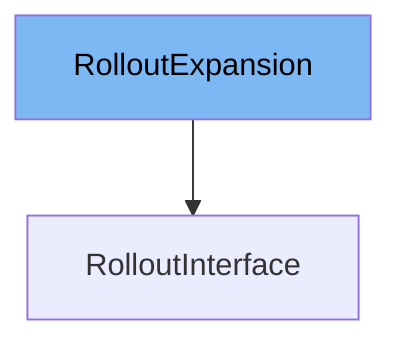

This document will cover the `RolloutInterface` class. We will discuss:

1. What `RolloutExpansion` is and what it is used for.
2. What `RolloutInterface` is and what it is used for.
3. Variables and functions defined in `RolloutInterface`.



# What is RolloutExpansion

`RolloutExpansion` is an empty interface defined in `pkg/client/clientset/versioned/typed/rollouts/v1alpha1/generated_expansion.go`. It is used as a placeholder for adding custom methods to the `RolloutInterface` without modifying the generated code. By embedding `RolloutExpansion` in `RolloutInterface`, developers can extend the functionality of the `RolloutInterface` by defining additional methods in a separate file.

# What is RolloutInterface

`RolloutInterface` is an interface defined in `pkg/client/clientset/versioned/typed/rollouts/v1alpha1/rollout.go`. It provides methods to work with Rollout resources in Kubernetes. The interface includes methods for creating, updating, deleting, retrieving, listing, watching, and patching Rollout resources. `RolloutInterface` embeds `RolloutExpansion`, allowing for the extension of its functionality through custom methods.

<SwmSnippet path="/pkg/client/clientset/versioned/typed/rollouts/v1alpha1/rollout.go" line="46" repo-id="Z2l0aHViJTNBJTNBaW50dWl0LWFyZ28tcm9sbG91dHMtZGVtbyUzQSUzQVN3aW1tLURlbW8=">

---

# Variables and functions

The `Get` function retrieves a Rollout resource by its name. It takes a context, the name of the rollout, and `GetOptions` as parameters and returns the corresponding Rollout object or an error if any.

```go
	Get(ctx context.Context, name string, opts v1.GetOptions) (*v1alpha1.Rollout, error)
	List(ctx context.Context, opts v1.ListOptions) (*v1alpha1.RolloutList, error)
```

---

</SwmSnippet>

<SwmSnippet path="/pkg/client/clientset/versioned/typed/rollouts/v1alpha1/rollout.go" line="80" repo-id="Z2l0aHViJTNBJTNBaW50dWl0LWFyZ28tcm9sbG91dHMtZGVtbyUzQSUzQVN3aW1tLURlbW8=">

---

The `List` function retrieves a list of Rollout resources that match the specified label and field selectors. It takes a context and `ListOptions` as parameters and returns a list of Rollout objects or an error if any.

```go
// List takes label and field selectors, and returns the list of Rollouts that match those selectors.
func (c *rollouts) List(ctx context.Context, opts v1.ListOptions) (result *v1alpha1.RolloutList, err error) {
	var timeout time.Duration
	if opts.TimeoutSeconds != nil {
		timeout = time.Duration(*opts.TimeoutSeconds) * time.Second
	}
	result = &v1alpha1.RolloutList{}
	err = c.client.Get().
		Namespace(c.ns).
		Resource("rollouts").
		VersionedParams(&opts, scheme.ParameterCodec).
		Timeout(timeout).
		Do(ctx).
		Into(result)
	return
```

---

</SwmSnippet>

<SwmSnippet path="/pkg/client/clientset/versioned/typed/rollouts/v1alpha1/rollout.go" line="97" repo-id="Z2l0aHViJTNBJTNBaW50dWl0LWFyZ28tcm9sbG91dHMtZGVtbyUzQSUzQVN3aW1tLURlbW8=">

---

The `Watch` function returns a watch.Interface that watches the requested Rollouts. It takes a context and `ListOptions` as parameters and returns a watch.Interface or an error if any.

```go
// Watch returns a watch.Interface that watches the requested rollouts.
func (c *rollouts) Watch(ctx context.Context, opts v1.ListOptions) (watch.Interface, error) {
	var timeout time.Duration
	if opts.TimeoutSeconds != nil {
		timeout = time.Duration(*opts.TimeoutSeconds) * time.Second
	}
	opts.Watch = true
	return c.client.Get().
		Namespace(c.ns).
		Resource("rollouts").
		VersionedParams(&opts, scheme.ParameterCodec).
		Timeout(timeout).
		Watch(ctx)
}
```

---

</SwmSnippet>

<SwmSnippet path="/pkg/client/clientset/versioned/typed/rollouts/v1alpha1/rollout.go" line="112" repo-id="Z2l0aHViJTNBJTNBaW50dWl0LWFyZ28tcm9sbG91dHMtZGVtbyUzQSUzQVN3aW1tLURlbW8=">

---

The `Create` function creates a new Rollout resource. It takes a context, the Rollout object to be created, and `CreateOptions` as parameters and returns the created Rollout object or an error if any.

```go
// Create takes the representation of a rollout and creates it.  Returns the server's representation of the rollout, and an error, if there is any.
func (c *rollouts) Create(ctx context.Context, rollout *v1alpha1.Rollout, opts v1.CreateOptions) (result *v1alpha1.Rollout, err error) {
	result = &v1alpha1.Rollout{}
	err = c.client.Post().
		Namespace(c.ns).
		Resource("rollouts").
		VersionedParams(&opts, scheme.ParameterCodec).
		Body(rollout).
		Do(ctx).
		Into(result)
	return
}
```

---

</SwmSnippet>

<SwmSnippet path="/pkg/client/clientset/versioned/typed/rollouts/v1alpha1/rollout.go" line="125" repo-id="Z2l0aHViJTNBJTNBaW50dWl0LWFyZ28tcm9sbG91dHMtZGVtbyUzQSUzQVN3aW1tLURlbW8=">

---

The `Update` function updates an existing Rollout resource. It takes a context, the Rollout object to be updated, and `UpdateOptions` as parameters and returns the updated Rollout object or an error if any.

```go
// Update takes the representation of a rollout and updates it. Returns the server's representation of the rollout, and an error, if there is any.
func (c *rollouts) Update(ctx context.Context, rollout *v1alpha1.Rollout, opts v1.UpdateOptions) (result *v1alpha1.Rollout, err error) {
	result = &v1alpha1.Rollout{}
	err = c.client.Put().
		Namespace(c.ns).
		Resource("rollouts").
		Name(rollout.Name).
		VersionedParams(&opts, scheme.ParameterCodec).
		Body(rollout).
		Do(ctx).
		Into(result)
	return
```

---

</SwmSnippet>

<SwmSnippet path="/pkg/client/clientset/versioned/typed/rollouts/v1alpha1/rollout.go" line="139" repo-id="Z2l0aHViJTNBJTNBaW50dWl0LWFyZ28tcm9sbG91dHMtZGVtbyUzQSUzQVN3aW1tLURlbW8=">

---

The `UpdateStatus` function updates the status of an existing Rollout resource. It takes a context, the Rollout object to be updated, and `UpdateOptions` as parameters and returns the updated Rollout object or an error if any.

```go
// UpdateStatus was generated because the type contains a Status member.
// Add a +genclient:noStatus comment above the type to avoid generating UpdateStatus().
func (c *rollouts) UpdateStatus(ctx context.Context, rollout *v1alpha1.Rollout, opts v1.UpdateOptions) (result *v1alpha1.Rollout, err error) {
	result = &v1alpha1.Rollout{}
	err = c.client.Put().
		Namespace(c.ns).
		Resource("rollouts").
		Name(rollout.Name).
		SubResource("status").
		VersionedParams(&opts, scheme.ParameterCodec).
		Body(rollout).
		Do(ctx).
		Into(result)
	return
```

---

</SwmSnippet>

<SwmSnippet path="/pkg/client/clientset/versioned/typed/rollouts/v1alpha1/rollout.go" line="155" repo-id="Z2l0aHViJTNBJTNBaW50dWl0LWFyZ28tcm9sbG91dHMtZGVtbyUzQSUzQVN3aW1tLURlbW8=">

---

The `Delete` function deletes a Rollout resource by its name. It takes a context, the name of the rollout, and `DeleteOptions` as parameters and returns an error if any.

```go
// Delete takes name of the rollout and deletes it. Returns an error if one occurs.
func (c *rollouts) Delete(ctx context.Context, name string, opts v1.DeleteOptions) error {
	return c.client.Delete().
		Namespace(c.ns).
		Resource("rollouts").
		Name(name).
		Body(&opts).
		Do(ctx).
		Error()
}
```

---

</SwmSnippet>

<SwmSnippet path="/pkg/client/clientset/versioned/typed/rollouts/v1alpha1/rollout.go" line="167" repo-id="Z2l0aHViJTNBJTNBaW50dWl0LWFyZ28tcm9sbG91dHMtZGVtbyUzQSUzQVN3aW1tLURlbW8=">

---

The `DeleteCollection` function deletes a collection of Rollout resources. It takes a context, `DeleteOptions`, and `ListOptions` as parameters and returns an error if any.

```go
func (c *rollouts) DeleteCollection(ctx context.Context, opts v1.DeleteOptions, listOpts v1.ListOptions) error {
	var timeout time.Duration
	if listOpts.TimeoutSeconds != nil {
		timeout = time.Duration(*listOpts.TimeoutSeconds) * time.Second
	}
	return c.client.Delete().
		Namespace(c.ns).
		Resource("rollouts").
		VersionedParams(&listOpts, scheme.ParameterCodec).
		Timeout(timeout).
		Body(&opts).
		Do(ctx).
		Error()
}
```

---

</SwmSnippet>

<SwmSnippet path="/pkg/client/clientset/versioned/typed/rollouts/v1alpha1/rollout.go" line="183" repo-id="Z2l0aHViJTNBJTNBaW50dWl0LWFyZ28tcm9sbG91dHMtZGVtbyUzQSUzQVN3aW1tLURlbW8=">

---

The `Patch` function applies a patch to a Rollout resource and returns the patched Rollout object. It takes a context, the name of the rollout, the patch type, the patch data, `PatchOptions`, and optional subresources as parameters and returns the patched Rollout object or an error if any.

```go
func (c *rollouts) Patch(ctx context.Context, name string, pt types.PatchType, data []byte, opts v1.PatchOptions, subresources ...string) (result *v1alpha1.Rollout, err error) {
	result = &v1alpha1.Rollout{}
	err = c.client.Patch(pt).
		Namespace(c.ns).
		Resource("rollouts").
		Name(name).
		SubResource(subresources...).
		VersionedParams(&opts, scheme.ParameterCodec).
		Body(data).
		Do(ctx).
		Into(result)
	return
}
```

---

</SwmSnippet>

&nbsp;

*This is an auto-generated document by Swimm 🌊 and has not yet been verified by a human*

<SwmMeta version="3.0.0"><sup>Powered by [Swimm](https://staging.swimm.cloud/)</sup></SwmMeta>
