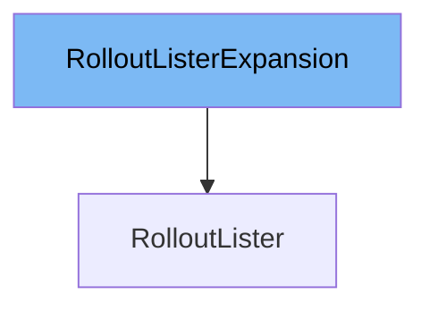

This document will cover the `RolloutLister` class. We will discuss:

1. What `expansion_generated.go` is and what it is used for.
2. What `RolloutLister` is and what it is used for.
3. The variables and functions defined in `RolloutLister`.



# What is `expansion_generated.go`

`expansion_generated.go` is a file that allows custom methods to be added to various lister interfaces in the Kubernetes client-go library. These interfaces include `RolloutLister`, `RolloutNamespaceLister`, and others. The purpose of this file is to provide a way to extend the functionality of these listers without modifying the auto-generated code directly.

# What is `RolloutLister`

`RolloutLister` is an interface defined in `pkg/client/listers/rollouts/v1alpha1/rollout.go`. It helps list `Rollouts` in the Kubernetes cluster. All objects returned by this lister must be treated as read-only. The `RolloutLister` interface provides methods to list all `Rollouts` and to get a `RolloutNamespaceLister` for a specific namespace. It also includes the `RolloutListerExpansion` interface, which allows for custom methods to be added.

<SwmSnippet path="/pkg/client/listers/rollouts/v1alpha1/rollout.go" line="49" repo-id="Z2l0aHViJTNBJTNBaW50dWl0LWFyZ28tcm9sbG91dHMtZGVtbyUzQSUzQVN3aW1tLURlbW8=">

---

# Variables and functions

The `List` function lists all `Rollouts` in the indexer. It takes a `labels.Selector` as an argument and returns a slice of `v1alpha1.Rollout` objects and an error. The function uses `cache.ListAll` to retrieve the `Rollouts` from the indexer.

```go
// List lists all Rollouts in the indexer.
func (s *rolloutLister) List(selector labels.Selector) (ret []*v1alpha1.Rollout, err error) {
	err = cache.ListAll(s.indexer, selector, func(m interface{}) {
		ret = append(ret, m.(*v1alpha1.Rollout))
	})
	return ret, err
}
```

---

</SwmSnippet>

<SwmSnippet path="/pkg/client/listers/rollouts/v1alpha1/rollout.go" line="57" repo-id="Z2l0aHViJTNBJTNBaW50dWl0LWFyZ28tcm9sbG91dHMtZGVtbyUzQSUzQVN3aW1tLURlbW8=">

---

The `Rollouts` function returns an object that can list and get `Rollouts` for a specific namespace. It takes a namespace string as an argument and returns a `RolloutNamespaceLister` object.

```go
// Rollouts returns an object that can list and get Rollouts.
func (s *rolloutLister) Rollouts(namespace string) RolloutNamespaceLister {
	return rolloutNamespaceLister{indexer: s.indexer, namespace: namespace}
}
```

---

</SwmSnippet>

<SwmSnippet path="/pkg/client/listers/rollouts/v1alpha1/rollout.go" line="81" repo-id="Z2l0aHViJTNBJTNBaW50dWl0LWFyZ28tcm9sbG91dHMtZGVtbyUzQSUzQVN3aW1tLURlbW8=">

---

The `List` function in `RolloutNamespaceLister` lists all `Rollouts` in the indexer for a given namespace. It takes a `labels.Selector` as an argument and returns a slice of `v1alpha1.Rollout` objects and an error. The function uses `cache.ListAllByNamespace` to retrieve the `Rollouts` from the indexer.

```go
// List lists all Rollouts in the indexer for a given namespace.
func (s rolloutNamespaceLister) List(selector labels.Selector) (ret []*v1alpha1.Rollout, err error) {
	err = cache.ListAllByNamespace(s.indexer, s.namespace, selector, func(m interface{}) {
		ret = append(ret, m.(*v1alpha1.Rollout))
	})
	return ret, err
}
```

---

</SwmSnippet>

<SwmSnippet path="/pkg/client/listers/rollouts/v1alpha1/rollout.go" line="89" repo-id="Z2l0aHViJTNBJTNBaW50dWl0LWFyZ28tcm9sbG91dHMtZGVtbyUzQSUzQVN3aW1tLURlbW8=">

---

The `Get` function in `RolloutNamespaceLister` retrieves a `Rollout` from the indexer for a given namespace and name. It takes a name string as an argument and returns a `v1alpha1.Rollout` object and an error. The function uses `indexer.GetByKey` to retrieve the `Rollout` from the indexer.

```go
// Get retrieves the Rollout from the indexer for a given namespace and name.
func (s rolloutNamespaceLister) Get(name string) (*v1alpha1.Rollout, error) {
	obj, exists, err := s.indexer.GetByKey(s.namespace + "/" + name)
	if err != nil {
		return nil, err
	}
	if !exists {
		return nil, errors.NewNotFound(v1alpha1.Resource("rollout"), name)
	}
	return obj.(*v1alpha1.Rollout), nil
}
```

---

</SwmSnippet>

&nbsp;

*This is an auto-generated document by Swimm 🌊 and has not yet been verified by a human*

<SwmMeta version="3.0.0"><sup>Powered by [Swimm](https://staging.swimm.cloud/)</sup></SwmMeta>
