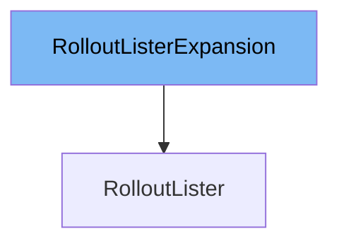

This document will cover the <SwmToken path="pkg/client/listers/rollouts/v1alpha1/expansion_generated.go" pos="49:2:2" line-data="// RolloutListerExpansion allows custom methods to be added to">`RolloutListerExpansion`</SwmToken> interface. We will discuss:

1. What <SwmToken path="pkg/client/listers/rollouts/v1alpha1/expansion_generated.go" pos="49:2:2" line-data="// RolloutListerExpansion allows custom methods to be added to">`RolloutListerExpansion`</SwmToken> is.
2. The variables and functions defined in <SwmToken path="pkg/client/listers/rollouts/v1alpha1/expansion_generated.go" pos="49:2:2" line-data="// RolloutListerExpansion allows custom methods to be added to">`RolloutListerExpansion`</SwmToken>.
3. An example of how to use <SwmToken path="pkg/client/listers/rollouts/v1alpha1/expansion_generated.go" pos="49:2:2" line-data="// RolloutListerExpansion allows custom methods to be added to">`RolloutListerExpansion`</SwmToken> in <SwmToken path="pkg/client/listers/rollouts/v1alpha1/expansion_generated.go" pos="50:2:2" line-data="// RolloutLister.">`RolloutLister`</SwmToken>.



# What is <SwmToken path="pkg/client/listers/rollouts/v1alpha1/expansion_generated.go" pos="49:2:2" line-data="// RolloutListerExpansion allows custom methods to be added to">`RolloutListerExpansion`</SwmToken>

<SwmToken path="pkg/client/listers/rollouts/v1alpha1/expansion_generated.go" pos="49:2:2" line-data="// RolloutListerExpansion allows custom methods to be added to">`RolloutListerExpansion`</SwmToken> is an interface defined in <SwmPath>[pkg/client/listers/rollouts/v1alpha1/expansion_generated.go](pkg/client/listers/rollouts/v1alpha1/expansion_generated.go)</SwmPath>. It allows custom methods to be added to the <SwmToken path="pkg/client/listers/rollouts/v1alpha1/expansion_generated.go" pos="50:2:2" line-data="// RolloutLister.">`RolloutLister`</SwmToken> interface. This is useful for extending the functionality of the <SwmToken path="pkg/client/listers/rollouts/v1alpha1/expansion_generated.go" pos="50:2:2" line-data="// RolloutLister.">`RolloutLister`</SwmToken> without modifying the generated code directly.

<SwmSnippet path="/pkg/client/listers/rollouts/v1alpha1/expansion_generated.go" line="49">

---

# Variables and functions

The <SwmToken path="pkg/client/listers/rollouts/v1alpha1/expansion_generated.go" pos="49:2:2" line-data="// RolloutListerExpansion allows custom methods to be added to">`RolloutListerExpansion`</SwmToken> interface itself is defined here. It does not contain any variables or functions by default, but it allows for the addition of custom methods to the <SwmToken path="pkg/client/listers/rollouts/v1alpha1/expansion_generated.go" pos="50:2:2" line-data="// RolloutLister.">`RolloutLister`</SwmToken>.

```go
// RolloutListerExpansion allows custom methods to be added to
// RolloutLister.
type RolloutListerExpansion interface{}
```

---

</SwmSnippet>

# Usage example

To use <SwmToken path="pkg/client/listers/rollouts/v1alpha1/expansion_generated.go" pos="49:2:2" line-data="// RolloutListerExpansion allows custom methods to be added to">`RolloutListerExpansion`</SwmToken>, you would typically define custom methods in a separate file and then implement those methods in a struct that embeds the generated <SwmToken path="pkg/client/listers/rollouts/v1alpha1/expansion_generated.go" pos="50:2:2" line-data="// RolloutLister.">`RolloutLister`</SwmToken>. Here is a conceptual example:

```go
// CustomRolloutLister is a struct that embeds the generated RolloutLister
// and implements the RolloutListerExpansion interface.
type CustomRolloutLister struct {
    RolloutLister
}

// CustomMethod is a custom method added to the RolloutLister.
func (c *CustomRolloutLister) CustomMethod() {
    // Custom implementation
}

// Now, CustomRolloutLister can be used wherever RolloutLister is expected,
// with the added functionality of CustomMethod.
```

&nbsp;

*This is an auto-generated document by Swimm 🌊 and has not yet been verified by a human*

<SwmMeta version="3.0.0" repo-id="Z2l0aHViJTNBJTNBaW50dWl0LWFyZ28tcm9sbG91dHMtZGVtbyUzQSUzQVN3aW1tLURlbW8=" repo-name="intuit-argo-rollouts-demo"><sup>Powered by [Swimm](/)</sup></SwmMeta>
