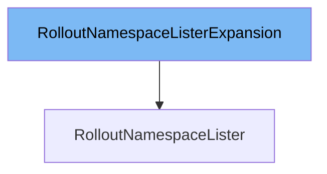

This document will cover the class `RolloutNamespaceLister`. We will discuss:

1. What `RolloutNamespaceListerExpansion` is and what it is used for.
2. What `RolloutNamespaceLister` is and what it is used for.
3. The variables and functions defined in `RolloutNamespaceLister`.



# What is RolloutNamespaceListerExpansion

`RolloutNamespaceListerExpansion` is an interface defined in the file `pkg/client/listers/rollouts/v1alpha1/expansion_generated.go`. It allows custom methods to be added to the `RolloutNamespaceLister` interface. This is useful for extending the functionality of the lister without modifying the generated code directly.

# What is RolloutNamespaceLister

`RolloutNamespaceLister` is an interface defined in the file `pkg/client/listers/rollouts/v1alpha1/rollout.go`. It helps list and get Rollouts in a given namespace. All objects returned by this lister must be treated as read-only. It is used to interact with the Rollouts stored in the indexer for a specific namespace. `RolloutNamespaceLister` is related to `RolloutNamespaceListerExpansion` as it can be extended using the custom methods defined in `RolloutNamespaceListerExpansion`.

<SwmSnippet path="/pkg/client/listers/rollouts/v1alpha1/rollout.go" line="65" repo-id="Z2l0aHViJTNBJTNBaW50dWl0LWFyZ28tcm9sbG91dHMtZGVtbyUzQSUzQVN3aW1tLURlbW8=">

---

# Variables and functions

The `List` function lists all Rollouts in the indexer for a given namespace. It takes a `labels.Selector` as an argument and returns a slice of `v1alpha1.Rollout` pointers and an error.

```go
	// List lists all Rollouts in the indexer for a given namespace.
	// Objects returned here must be treated as read-only.
	List(selector labels.Selector) (ret []*v1alpha1.Rollout, err error)
```

---

</SwmSnippet>

<SwmSnippet path="/pkg/client/listers/rollouts/v1alpha1/rollout.go" line="68" repo-id="Z2l0aHViJTNBJTNBaW50dWl0LWFyZ28tcm9sbG91dHMtZGVtbyUzQSUzQVN3aW1tLURlbW8=">

---

The `Get` function retrieves the Rollout from the indexer for a given namespace and name. It takes a string `name` as an argument and returns a pointer to `v1alpha1.Rollout` and an error.

```go
	// Get retrieves the Rollout from the indexer for a given namespace and name.
	// Objects returned here must be treated as read-only.
	Get(name string) (*v1alpha1.Rollout, error)
```

---

</SwmSnippet>

<SwmSnippet path="/pkg/client/listers/rollouts/v1alpha1/rollout.go" line="81" repo-id="Z2l0aHViJTNBJTNBaW50dWl0LWFyZ28tcm9sbG91dHMtZGVtbyUzQSUzQVN3aW1tLURlbW8=">

---

The `List` function implementation lists all Rollouts in the indexer for a given namespace. It uses `cache.ListAllByNamespace` to fetch the Rollouts and appends them to the result slice.

```go
// List lists all Rollouts in the indexer for a given namespace.
func (s rolloutNamespaceLister) List(selector labels.Selector) (ret []*v1alpha1.Rollout, err error) {
	err = cache.ListAllByNamespace(s.indexer, s.namespace, selector, func(m interface{}) {
		ret = append(ret, m.(*v1alpha1.Rollout))
	})
	return ret, err
}
```

---

</SwmSnippet>

<SwmSnippet path="/pkg/client/listers/rollouts/v1alpha1/rollout.go" line="89" repo-id="Z2l0aHViJTNBJTNBaW50dWl0LWFyZ28tcm9sbG91dHMtZGVtbyUzQSUzQVN3aW1tLURlbW8=">

---

The `Get` function implementation retrieves the Rollout from the indexer for a given namespace and name. It uses `indexer.GetByKey` to fetch the Rollout and returns it if it exists, otherwise, it returns an error.

```go
// Get retrieves the Rollout from the indexer for a given namespace and name.
func (s rolloutNamespaceLister) Get(name string) (*v1alpha1.Rollout, error) {
	obj, exists, err := s.indexer.GetByKey(s.namespace + "/" + name)
	if err != nil {
		return nil, err
	}
	if !exists {
		return nil, errors.NewNotFound(v1alpha1.Resource("rollout"), name)
	}
	return obj.(*v1alpha1.Rollout), nil
}
```

---

</SwmSnippet>

&nbsp;

*This is an auto-generated document by Swimm 🌊 and has not yet been verified by a human*

<SwmMeta version="3.0.0"><sup>Powered by [Swimm](https://staging.swimm.cloud/)</sup></SwmMeta>
