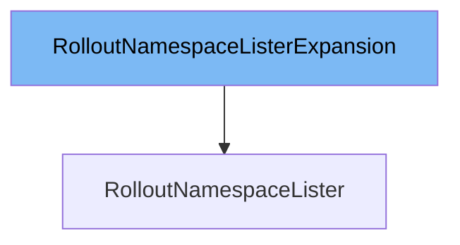

This document will cover the class <SwmToken path="pkg/client/listers/rollouts/v1alpha1/expansion_generated.go" pos="53:2:2" line-data="// RolloutNamespaceListerExpansion allows custom methods to be added to">`RolloutNamespaceListerExpansion`</SwmToken>. We will discuss:

1. What <SwmToken path="pkg/client/listers/rollouts/v1alpha1/expansion_generated.go" pos="53:2:2" line-data="// RolloutNamespaceListerExpansion allows custom methods to be added to">`RolloutNamespaceListerExpansion`</SwmToken> is.
2. The variables and functions defined in <SwmToken path="pkg/client/listers/rollouts/v1alpha1/expansion_generated.go" pos="53:2:2" line-data="// RolloutNamespaceListerExpansion allows custom methods to be added to">`RolloutNamespaceListerExpansion`</SwmToken>.
3. An example of how to use <SwmToken path="pkg/client/listers/rollouts/v1alpha1/expansion_generated.go" pos="53:2:2" line-data="// RolloutNamespaceListerExpansion allows custom methods to be added to">`RolloutNamespaceListerExpansion`</SwmToken> in <SwmToken path="pkg/client/listers/rollouts/v1alpha1/expansion_generated.go" pos="54:2:2" line-data="// RolloutNamespaceLister.">`RolloutNamespaceLister`</SwmToken>.



# What is <SwmToken path="pkg/client/listers/rollouts/v1alpha1/expansion_generated.go" pos="53:2:2" line-data="// RolloutNamespaceListerExpansion allows custom methods to be added to">`RolloutNamespaceListerExpansion`</SwmToken>

<SwmToken path="pkg/client/listers/rollouts/v1alpha1/expansion_generated.go" pos="53:2:2" line-data="// RolloutNamespaceListerExpansion allows custom methods to be added to">`RolloutNamespaceListerExpansion`</SwmToken> is an interface defined in the file <SwmPath>[pkg/client/listers/rollouts/v1alpha1/expansion_generated.go](pkg/client/listers/rollouts/v1alpha1/expansion_generated.go)</SwmPath>. It allows custom methods to be added to the <SwmToken path="pkg/client/listers/rollouts/v1alpha1/expansion_generated.go" pos="54:2:2" line-data="// RolloutNamespaceLister.">`RolloutNamespaceLister`</SwmToken> interface. This is useful for extending the functionality of the lister without modifying the generated code directly.

<SwmSnippet path="/pkg/client/listers/rollouts/v1alpha1/expansion_generated.go" line="53">

---

# Variables and functions

The <SwmToken path="pkg/client/listers/rollouts/v1alpha1/expansion_generated.go" pos="53:2:2" line-data="// RolloutNamespaceListerExpansion allows custom methods to be added to">`RolloutNamespaceListerExpansion`</SwmToken> interface itself is defined here. It does not contain any variables or functions by default, but it allows for the addition of custom methods to the <SwmToken path="pkg/client/listers/rollouts/v1alpha1/expansion_generated.go" pos="54:2:2" line-data="// RolloutNamespaceLister.">`RolloutNamespaceLister`</SwmToken> interface.

```go
// RolloutNamespaceListerExpansion allows custom methods to be added to
// RolloutNamespaceLister.
type RolloutNamespaceListerExpansion interface{}
```

---

</SwmSnippet>

# Usage example

To use <SwmToken path="pkg/client/listers/rollouts/v1alpha1/expansion_generated.go" pos="53:2:2" line-data="// RolloutNamespaceListerExpansion allows custom methods to be added to">`RolloutNamespaceListerExpansion`</SwmToken>, you would typically define custom methods in a separate file and ensure that your <SwmToken path="pkg/client/listers/rollouts/v1alpha1/expansion_generated.go" pos="54:2:2" line-data="// RolloutNamespaceLister.">`RolloutNamespaceLister`</SwmToken> implementation includes these methods. Here is an example of how you might extend <SwmToken path="pkg/client/listers/rollouts/v1alpha1/expansion_generated.go" pos="54:2:2" line-data="// RolloutNamespaceLister.">`RolloutNamespaceLister`</SwmToken> with a custom method.

<SwmSnippet path="/pkg/client/listers/rollouts/v1alpha1/rollout.go" line="1">

---

In this example, we assume that <SwmToken path="pkg/client/listers/rollouts/v1alpha1/expansion_generated.go" pos="54:2:2" line-data="// RolloutNamespaceLister.">`RolloutNamespaceLister`</SwmToken> is implemented in the file <SwmPath>[pkg/client/listers/rollouts/v1alpha1/rollout.go](pkg/client/listers/rollouts/v1alpha1/rollout.go)</SwmPath>. You would add your custom methods to this implementation.

```go
/*
Copyright The Kubernetes Authors.

Licensed under the Apache License, Version 2.0 (the "License");
you may not use this file except in compliance with the License.
You may obtain a copy of the License at

    http://www.apache.org/licenses/LICENSE-2.0

Unless required by applicable law or agreed to in writing, software
distributed under the License is distributed on an "AS IS" BASIS,
WITHOUT WARRANTIES OR CONDITIONS OF ANY KIND, either express or implied.
See the License for the specific language governing permissions and
limitations under the License.
*/
```

---

</SwmSnippet>

&nbsp;

*This is an auto-generated document by Swimm 🌊 and has not yet been verified by a human*

<SwmMeta version="3.0.0" repo-id="Z2l0aHViJTNBJTNBaW50dWl0LWFyZ28tcm9sbG91dHMtZGVtbyUzQSUzQVN3aW1tLURlbW8=" repo-name="intuit-argo-rollouts-demo"><sup>Powered by [Swimm](/)</sup></SwmMeta>
