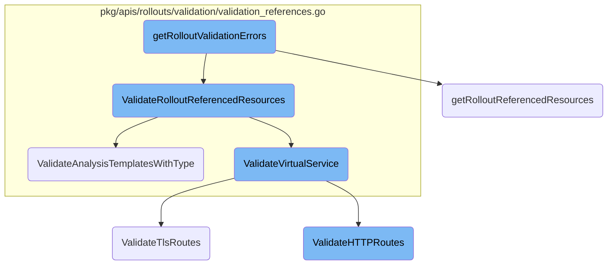
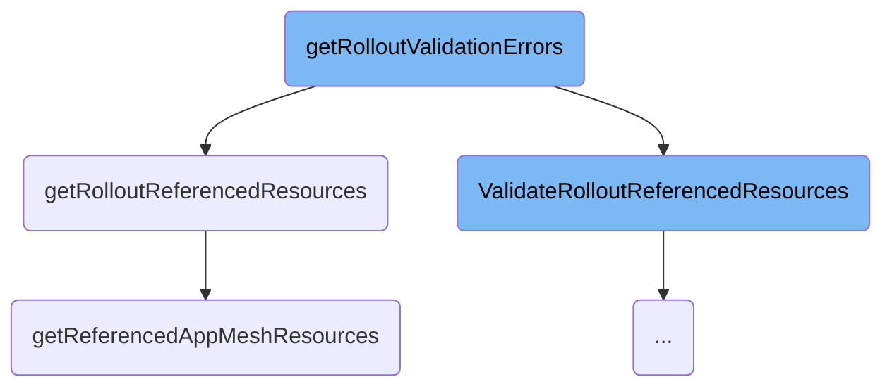
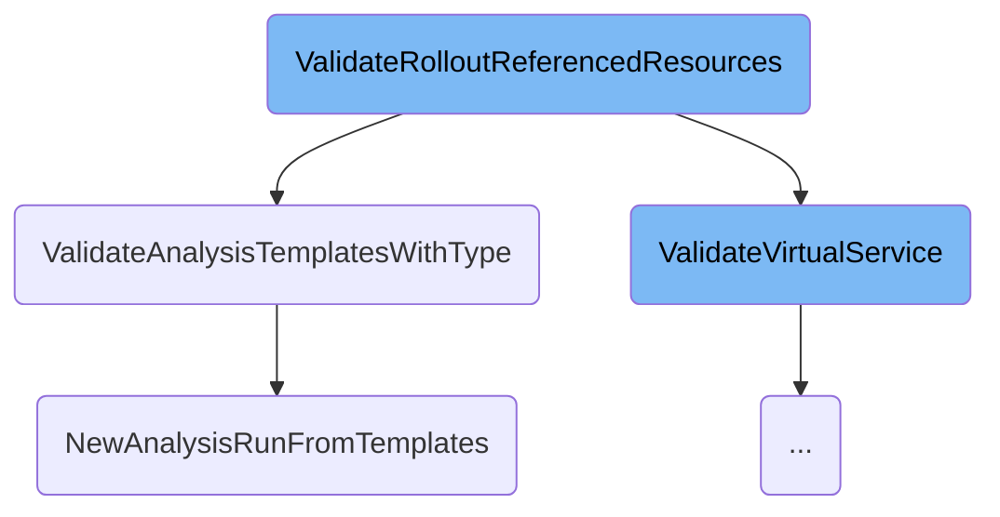
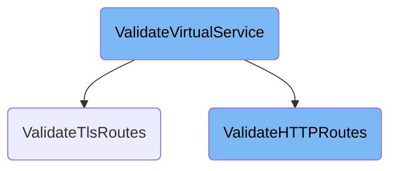

In this document, we will explain the process of validating rollout configurations and the resources they reference. This process ensures that all configurations and resources are correctly set up before proceeding with the deployment.

The flow starts by validating the rollout configuration to ensure it meets the necessary criteria. If any errors are found, they are returned immediately. Next, the process gathers and validates all resources referenced by the rollout, such as services, analysis templates, and virtual services. Each type of resource is checked to ensure it is correctly configured. If any issues are found, they are returned to prevent deployment failures. This thorough validation process helps in catching misconfigurations early, ensuring a smooth deployment.

Here is a high level diagram of the flow, showing only the most important functions:



# Flow drill down

First, we'll zoom into this section of the flow:



<SwmSnippet path="/rollout/controller.go" line="578">

---

## Validating Rollout Configurations

The function <SwmToken path="rollout/controller.go" pos="578:9:9" line-data="func (c *rolloutContext) getRolloutValidationErrors() error {">`getRolloutValidationErrors`</SwmToken> starts by validating the rollout configuration using <SwmToken path="rollout/controller.go" pos="579:5:7" line-data="	rolloutValidationErrors := validation.ValidateRollout(c.rollout)">`validation.ValidateRollout`</SwmToken>. If any validation errors are found, the first error is returned immediately. This ensures that only valid rollout configurations proceed further.

```go
func (c *rolloutContext) getRolloutValidationErrors() error {
	rolloutValidationErrors := validation.ValidateRollout(c.rollout)
	if len(rolloutValidationErrors) > 0 {
		return rolloutValidationErrors[0]
	}
```

---

</SwmSnippet>

<SwmSnippet path="/rollout/controller.go" line="584">

---

## Validating Referenced Resources

Next, the function <SwmToken path="rollout/controller.go" pos="584:10:10" line-data="	refResources, err := c.getRolloutReferencedResources()">`getRolloutReferencedResources`</SwmToken> is called to gather and validate all resources referenced by the rollout. If any errors occur during this process, they are returned, preventing invalid references from causing issues during deployment.

```go
	refResources, err := c.getRolloutReferencedResources()
	if err != nil {
		return err
	}
```

---

</SwmSnippet>

<SwmSnippet path="/rollout/controller.go" line="619">

---

## Validating Specific Resource Types

The function <SwmToken path="rollout/controller.go" pos="619:9:9" line-data="func (c *rolloutContext) getRolloutReferencedResources() (*validation.ReferencedResources, error) {">`getRolloutReferencedResources`</SwmToken> performs detailed validation for various resource types such as services, analysis templates, ingress controllers, virtual services, and <SwmToken path="rollout/controller.go" pos="685:17:17" line-data="		if canary.TrafficRouting != nil &amp;&amp; canary.TrafficRouting.AppMesh != nil {">`AppMesh`</SwmToken> resources. Each type of resource is validated to ensure it meets the necessary criteria before being referenced in the rollout.

```go
func (c *rolloutContext) getRolloutReferencedResources() (*validation.ReferencedResources, error) {
	refResources := validation.ReferencedResources{}
	services, err := c.getReferencedServices()
	if err != nil {
		return nil, err
	}
	refResources.ServiceWithType = *services

	analysisTemplates, err := c.getReferencedRolloutAnalyses()
	if err != nil {
		return nil, err
	}
	refResources.AnalysisTemplatesWithType = *analysisTemplates

	// Validate Rollout Nginx Ingress Controller before referencing
	err = validation.ValidateRolloutNginxIngressesConfig(c.rollout)
	if err != nil {
		return nil, err
	}

	// Validate Rollout ALB Ingress Controller before referencing
```

---

</SwmSnippet>

<SwmSnippet path="/rollout/controller.go" line="678">

---

### Validating <SwmToken path="rollout/controller.go" pos="685:17:17" line-data="		if canary.TrafficRouting != nil &amp;&amp; canary.TrafficRouting.AppMesh != nil {">`AppMesh`</SwmToken> Resources

The function <SwmToken path="rollout/controller.go" pos="678:9:9" line-data="func (c *rolloutContext) getReferencedAppMeshResources() ([]unstructured.Unstructured, error) {">`getReferencedAppMeshResources`</SwmToken> specifically handles the validation of <SwmToken path="rollout/controller.go" pos="685:17:17" line-data="		if canary.TrafficRouting != nil &amp;&amp; canary.TrafficRouting.AppMesh != nil {">`AppMesh`</SwmToken> resources. It checks if the canary strategy's traffic routing configuration includes a valid <SwmToken path="rollout/controller.go" pos="685:17:17" line-data="		if canary.TrafficRouting != nil &amp;&amp; canary.TrafficRouting.AppMesh != nil {">`AppMesh`</SwmToken> virtual service. If the virtual service or its associated virtual router is not found, appropriate errors are returned. This ensures that the <SwmToken path="rollout/controller.go" pos="685:17:17" line-data="		if canary.TrafficRouting != nil &amp;&amp; canary.TrafficRouting.AppMesh != nil {">`AppMesh`</SwmToken> configuration is correct and ready for use in the rollout.

```go
func (c *rolloutContext) getReferencedAppMeshResources() ([]unstructured.Unstructured, error) {
	ctx := context.TODO()
	appmeshClient := appmesh.NewResourceClient(c.dynamicclientset)
	rollout := c.rollout
	refResources := []unstructured.Unstructured{}
	if rollout.Spec.Strategy.Canary != nil {
		canary := rollout.Spec.Strategy.Canary
		if canary.TrafficRouting != nil && canary.TrafficRouting.AppMesh != nil {
			fldPath := field.NewPath("spec", "strategy", "canary", "trafficRouting", "appmesh", "virtualService")
			tr := canary.TrafficRouting.AppMesh
			if tr.VirtualService == nil {
				return nil, field.Invalid(fldPath, nil, "must provide virtual-service")
			}

			vsvc, err := appmeshClient.GetVirtualServiceCR(ctx, c.rollout.Namespace, tr.VirtualService.Name)
			if err != nil {
				if k8serrors.IsNotFound(err) {
					return nil, field.Invalid(fldPath, fmt.Sprintf("%s.%s", tr.VirtualService.Name, c.rollout.Namespace), err.Error())
				}
				return nil, err
			}
```

---

</SwmSnippet>

Now, lets zoom into this section of the flow:



<SwmSnippet path="/pkg/apis/rollouts/validation/validation_references.go" line="70">

---

## Validating Referenced Resources

The function <SwmToken path="pkg/apis/rollouts/validation/validation_references.go" pos="70:2:2" line-data="func ValidateRolloutReferencedResources(rollout *v1alpha1.Rollout, referencedResources ReferencedResources) field.ErrorList {">`ValidateRolloutReferencedResources`</SwmToken> iterates through various referenced resources such as services, analysis templates, ingresses, virtual services, ambassador mappings, and <SwmToken path="rollout/controller.go" pos="685:17:17" line-data="		if canary.TrafficRouting != nil &amp;&amp; canary.TrafficRouting.AppMesh != nil {">`AppMesh`</SwmToken> resources. It validates each of these resources to ensure they are correctly configured and can be used in the rollout process. This step is crucial for preventing misconfigurations that could lead to deployment failures.

```go
func ValidateRolloutReferencedResources(rollout *v1alpha1.Rollout, referencedResources ReferencedResources) field.ErrorList {
	allErrs := field.ErrorList{}
	for _, service := range referencedResources.ServiceWithType {
		allErrs = append(allErrs, ValidateService(service, rollout)...)
	}
	for _, templates := range referencedResources.AnalysisTemplatesWithType {
		allErrs = append(allErrs, ValidateAnalysisTemplatesWithType(rollout, templates)...)
	}
	for _, ingress := range referencedResources.Ingresses {
		allErrs = append(allErrs, ValidateIngress(rollout, &ingress)...)
	}
	for _, vsvc := range referencedResources.VirtualServices {
		allErrs = append(allErrs, ValidateVirtualService(rollout, vsvc)...)
	}
	for _, mapping := range referencedResources.AmbassadorMappings {
		allErrs = append(allErrs, ValidateAmbassadorMapping(mapping)...)
	}
	for _, appmeshRes := range referencedResources.AppMeshResources {
		allErrs = append(allErrs, ValidateAppMeshResource(appmeshRes)...)
	}
	return allErrs
```

---

</SwmSnippet>

<SwmSnippet path="/pkg/apis/rollouts/validation/validation_references.go" line="121">

---

### Validating Analysis Templates

The function <SwmToken path="pkg/apis/rollouts/validation/validation_references.go" pos="121:2:2" line-data="func ValidateAnalysisTemplatesWithType(rollout *v1alpha1.Rollout, templates AnalysisTemplatesWithType) field.ErrorList {">`ValidateAnalysisTemplatesWithType`</SwmToken> is responsible for validating analysis templates associated with a rollout. It checks if the templates can be used to create an analysis run and ensures that all necessary parameters are correctly set. This validation helps in ensuring that the analysis phase of the rollout will execute without errors.

```go
func ValidateAnalysisTemplatesWithType(rollout *v1alpha1.Rollout, templates AnalysisTemplatesWithType) field.ErrorList {
	allErrs := field.ErrorList{}
	fldPath := GetAnalysisTemplateWithTypeFieldPath(templates.TemplateType, templates.CanaryStepIndex)
	if fldPath == nil {
		return allErrs
	}

	templateNames := GetAnalysisTemplateNames(templates)
	value := fmt.Sprintf("templateNames: %s", templateNames)
	_, err := analysisutil.NewAnalysisRunFromTemplates(templates.AnalysisTemplates, templates.ClusterAnalysisTemplates, buildAnalysisArgs(templates.Args, rollout), []v1alpha1.DryRun{}, []v1alpha1.MeasurementRetention{}, make(map[string]string), make(map[string]string), "", "", "")
	if err != nil {
		allErrs = append(allErrs, field.Invalid(fldPath, value, err.Error()))
		return allErrs
	}

	if rollout.Spec.Strategy.Canary != nil {
		for _, step := range rollout.Spec.Strategy.Canary.Steps {
			if step.Analysis != nil {
				_, err := analysisutil.NewAnalysisRunFromTemplates(templates.AnalysisTemplates, templates.ClusterAnalysisTemplates, buildAnalysisArgs(templates.Args, rollout), step.Analysis.DryRun, step.Analysis.MeasurementRetention, make(map[string]string), make(map[string]string), "", "", "")
				if err != nil {
					allErrs = append(allErrs, field.Invalid(fldPath, value, err.Error()))
```

---

</SwmSnippet>

<SwmSnippet path="/utils/analysis/helpers.go" line="291">

---

### Creating Analysis Runs

The function <SwmToken path="utils/analysis/helpers.go" pos="291:2:2" line-data="func NewAnalysisRunFromTemplates(templates []*v1alpha1.AnalysisTemplate, clusterTemplates []*v1alpha1.ClusterAnalysisTemplate, args []v1alpha1.Argument, dryRunMetrics []v1alpha1.DryRun,">`NewAnalysisRunFromTemplates`</SwmToken> creates a new analysis run from the provided templates. It merges arguments, dry run metrics, and measurement retention metrics, and then constructs an <SwmToken path="utils/analysis/helpers.go" pos="294:16:16" line-data="	name, generateName, namespace string) (*v1alpha1.AnalysisRun, error) {">`AnalysisRun`</SwmToken> object. This function is essential for generating the analysis runs that will be used to evaluate the success of the rollout.

```go
func NewAnalysisRunFromTemplates(templates []*v1alpha1.AnalysisTemplate, clusterTemplates []*v1alpha1.ClusterAnalysisTemplate, args []v1alpha1.Argument, dryRunMetrics []v1alpha1.DryRun,
	measurementRetentionMetrics []v1alpha1.MeasurementRetention,
	labels map[string]string, annotations map[string]string,
	name, generateName, namespace string) (*v1alpha1.AnalysisRun, error) {
	template, err := FlattenTemplates(templates, clusterTemplates)
	if err != nil {
		return nil, err
	}
	newArgs, err := MergeArgs(args, template.Spec.Args)
	if err != nil {
		return nil, err
	}
	dryRun, err := mergeDryRunMetrics(dryRunMetrics, template.Spec.DryRun)
	if err != nil {
		return nil, err
	}
	measurementRetention, err := mergeMeasurementRetentionMetrics(measurementRetentionMetrics, template.Spec.MeasurementRetention)
	if err != nil {
		return nil, err
	}
	ar := v1alpha1.AnalysisRun{
```

---

</SwmSnippet>

Now, lets zoom into this section of the flow:



<SwmSnippet path="/pkg/apis/rollouts/validation/validation_references.go" line="357">

---

## <SwmToken path="pkg/apis/rollouts/validation/validation_references.go" pos="357:2:2" line-data="func ValidateVirtualService(rollout *v1alpha1.Rollout, obj unstructured.Unstructured) field.ErrorList {">`ValidateVirtualService`</SwmToken>

The <SwmToken path="pkg/apis/rollouts/validation/validation_references.go" pos="357:2:2" line-data="func ValidateVirtualService(rollout *v1alpha1.Rollout, obj unstructured.Unstructured) field.ErrorList {">`ValidateVirtualService`</SwmToken> function ensures that the Istio <SwmToken path="pkg/apis/rollouts/validation/validation_references.go" pos="377:24:24" line-data="		virtualServices = []v1alpha1.IstioVirtualService{*rollout.Spec.Strategy.Canary.TrafficRouting.Istio.VirtualService}">`VirtualService`</SwmToken> configuration in the rollout is correct. It checks if the rollout is configured with Istio traffic routing and validates the HTTP, TLS, and TCP routes. If any of these routes are missing or invalid, it returns an error.

```go
func ValidateVirtualService(rollout *v1alpha1.Rollout, obj unstructured.Unstructured) field.ErrorList {
	var fldPath *field.Path
	var virtualServices []v1alpha1.IstioVirtualService
	allErrs := field.ErrorList{}
	newObj := obj.DeepCopy()

	if rollout.Spec.Strategy.Canary == nil ||
		rollout.Spec.Strategy.Canary.TrafficRouting == nil ||
		rollout.Spec.Strategy.Canary.TrafficRouting.Istio == nil {

		msg := "Rollout object is not configured with Istio traffic routing"
		allErrs = append(allErrs, field.Invalid(field.NewPath("spec", "strategy", "canary", "trafficRouting", "istio"), rollout.Name, msg))
		return allErrs
	}

	if istioutil.MultipleVirtualServiceConfigured(rollout) {
		fldPath = field.NewPath("spec", "strategy", "canary", "trafficRouting", "istio", "virtualServices", "name")
		virtualServices = rollout.Spec.Strategy.Canary.TrafficRouting.Istio.VirtualServices
	} else {
		fldPath = field.NewPath("spec", "strategy", "canary", "trafficRouting", "istio", "virtualService", "name")
		virtualServices = []v1alpha1.IstioVirtualService{*rollout.Spec.Strategy.Canary.TrafficRouting.Istio.VirtualService}
```

---

</SwmSnippet>

<SwmSnippet path="/pkg/apis/rollouts/validation/validation_references.go" line="395">

---

### Validating HTTP Routes

The function checks if HTTP routes are present and valid. If HTTP routes are found, it validates them using the <SwmToken path="pkg/apis/rollouts/validation/validation_references.go" pos="401:7:7" line-data="					err = istio.ValidateHTTPRoutes(rollout, virtualService.Routes, httpRoutes)">`ValidateHTTPRoutes`</SwmToken> function. Any errors in the HTTP routes are appended to the error list.

```go
			if errHttp == nil {
				httpRoutes, err := istio.GetHttpRoutes(httpRoutesI)
				if err != nil {
					msg := "Unable to get HTTP routes for Istio VirtualService"
					allErrs = append(allErrs, field.Invalid(fldPath, vsvcName, msg))
				} else {
					err = istio.ValidateHTTPRoutes(rollout, virtualService.Routes, httpRoutes)
					if err != nil {
						msg := fmt.Sprintf("Istio VirtualService has invalid HTTP routes. Error: %s", err.Error())
						allErrs = append(allErrs, field.Invalid(fldPath, vsvcName, msg))
					}
				}
			}
```

---

</SwmSnippet>

<SwmSnippet path="/pkg/apis/rollouts/validation/validation_references.go" line="409">

---

### Validating TLS Routes

The function checks if TLS routes are present and valid. If TLS routes are found, it validates them using the <SwmToken path="pkg/apis/rollouts/validation/validation_references.go" pos="415:7:7" line-data="					err = istio.ValidateTlsRoutes(rollout, virtualService.TLSRoutes, tlsRoutes)">`ValidateTlsRoutes`</SwmToken> function. Any errors in the TLS routes are appended to the error list.

```go
			if errTls == nil {
				tlsRoutes, err := istio.GetTlsRoutes(newObj, tlsRoutesI)
				if err != nil {
					msg := "Unable to get TLS routes for Istio VirtualService"
					allErrs = append(allErrs, field.Invalid(fldPath, vsvcName, msg))
				} else {
					err = istio.ValidateTlsRoutes(rollout, virtualService.TLSRoutes, tlsRoutes)
					if err != nil {
						msg := fmt.Sprintf("Istio VirtualService has invalid TLS routes. Error: %s", err.Error())
						allErrs = append(allErrs, field.Invalid(fldPath, vsvcName, msg))
					}
				}
			}
```

---

</SwmSnippet>

<SwmSnippet path="/rollout/trafficrouting/istio/istio.go" line="1078">

---

## <SwmToken path="rollout/trafficrouting/istio/istio.go" pos="1078:2:2" line-data="func ValidateTlsRoutes(r *v1alpha1.Rollout, vsvcTLSRoutes []v1alpha1.TLSRoute, tlsRoutes []VirtualServiceTLSRoute) error {">`ValidateTlsRoutes`</SwmToken>

The <SwmToken path="rollout/trafficrouting/istio/istio.go" pos="1078:2:2" line-data="func ValidateTlsRoutes(r *v1alpha1.Rollout, vsvcTLSRoutes []v1alpha1.TLSRoute, tlsRoutes []VirtualServiceTLSRoute) error {">`ValidateTlsRoutes`</SwmToken> function ensures that all the TLS routes in the rollout exist and have the correct destinations. It checks if the routes have exactly two destinations and validates them against the stable and canary services.

```go
func ValidateTlsRoutes(r *v1alpha1.Rollout, vsvcTLSRoutes []v1alpha1.TLSRoute, tlsRoutes []VirtualServiceTLSRoute) error {
	stableSvc, canarySvc := trafficrouting.GetStableAndCanaryServices(r, false)

	routeIndexesToPatch, err := getTlsRouteIndexesToPatch(vsvcTLSRoutes, tlsRoutes)
	if err != nil {
		return err
	}
	for _, routeIndex := range routeIndexesToPatch {
		route := tlsRoutes[routeIndex]
		err := validateVirtualServiceRouteDestinations(route.Route, stableSvc, canarySvc, r.Spec.Strategy.Canary.TrafficRouting.Istio.DestinationRule)
		if err != nil {
			return err
		}
	}
	if len(vsvcTLSRoutes) == 0 && len(tlsRoutes) > 1 {
		return fmt.Errorf("spec.tls[] should be set in VirtualService and it must have exactly one route when omitting spec.strategy.canary.trafficRouting.istio.virtualService.tlsRoutes")
	}
	return nil
}
```

---

</SwmSnippet>

<SwmSnippet path="/rollout/trafficrouting/istio/istio.go" line="1041">

---

## <SwmToken path="rollout/trafficrouting/istio/istio.go" pos="1041:2:2" line-data="func ValidateHTTPRoutes(r *v1alpha1.Rollout, routeNames []string, httpRoutes []VirtualServiceHTTPRoute) error {">`ValidateHTTPRoutes`</SwmToken>

The <SwmToken path="rollout/trafficrouting/istio/istio.go" pos="1041:2:2" line-data="func ValidateHTTPRoutes(r *v1alpha1.Rollout, routeNames []string, httpRoutes []VirtualServiceHTTPRoute) error {">`ValidateHTTPRoutes`</SwmToken> function ensures that all the HTTP routes in the rollout exist and are correctly configured. It validates the routes against the stable and canary services and checks if the routes are within the managed routes.

```go
func ValidateHTTPRoutes(r *v1alpha1.Rollout, routeNames []string, httpRoutes []VirtualServiceHTTPRoute) error {
	stableSvc, canarySvc := trafficrouting.GetStableAndCanaryServices(r, false)

	routeIndexesToPatch, err := getHttpRouteIndexesToPatch(routeNames, httpRoutes)
	if err != nil {
		return err
	}
	for _, routeIndex := range routeIndexesToPatch {
		route := httpRoutes[routeIndex]
		err := validateVirtualServiceRouteDestinations(route.Route, stableSvc, canarySvc, r.Spec.Strategy.Canary.TrafficRouting.Istio.DestinationRule)
		if err != nil {
			return err
		}
	}

	httpRoutesBytes, err := json.Marshal(httpRoutes)
	if err != nil {
		return fmt.Errorf("[ValidateHTTPRoutes] failed to marshal http routes: %w", err)
	}
	var httpRoutesI []any
	err = json.Unmarshal(httpRoutesBytes, &httpRoutesI)
```

---

</SwmSnippet>

&nbsp;

*This is an auto-generated document by Swimm 🌊 and has not yet been verified by a human*

<SwmMeta version="3.0.0" repo-id="Z2l0aHViJTNBJTNBaW50dWl0LWFyZ28tcm9sbG91dHMtZGVtbyUzQSUzQVN3aW1tLURlbW8=" repo-name="intuit-argo-rollouts-demo"><sup>Powered by [Swimm](/)</sup></SwmMeta>
