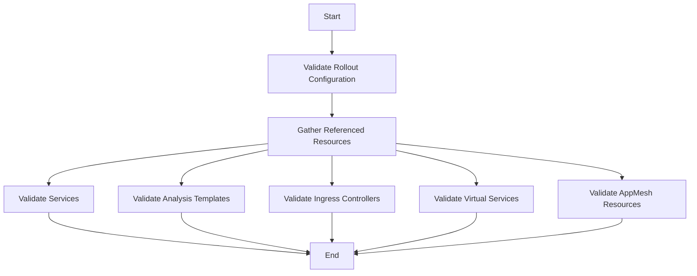

This document will cover the process of validating rollout configurations and resources. We'll cover:

1. Validating the rollout configuration
2. Gathering and validating referenced resources
3. Validating specific resource types

Technical document: <SwmLink doc-title="Validating Rollout Configurations and Resources">[Validating Rollout Configurations and Resources](/.swm/validating-rollout-configurations-and-resources.f8119j89.sw.md)</SwmLink>

# [Validating the rollout configuration](http://localhost:5001/repos/Z2l0aHViJTNBJTNBaW50dWl0LWFyZ28tcm9sbG91dHMtZGVtbyUzQSUzQVN3aW1tLURlbW8=/docs/f8119j89#validating-rollout-configurations)

The first step in the process is to validate the rollout configuration. This ensures that the configuration meets all necessary criteria before proceeding. If any errors are found during this validation, they are returned immediately. This step is crucial to prevent invalid configurations from causing issues later in the deployment process.

# [Gathering and validating referenced resources](http://localhost:5001/repos/Z2l0aHViJTNBJTNBaW50dWl0LWFyZ28tcm9sbG91dHMtZGVtbyUzQSUzQVN3aW1tLURlbW8=/docs/f8119j89#validating-referenced-resources)

After validating the rollout configuration, the next step is to gather and validate all resources referenced by the rollout. These resources include services, analysis templates, ingress controllers, virtual services, and <SwmToken path="pkg/apis/rollouts/v1alpha1/types.go" pos="375:1:1" line-data="	AppMesh *AppMeshTrafficRouting `json:&quot;appMesh,omitempty&quot; protobuf:&quot;bytes,6,opt,name=appMesh&quot;`">`AppMesh`</SwmToken> resources. Each type of resource is checked to ensure it is correctly configured. If any issues are found, they are returned to prevent deployment failures. This step ensures that all necessary resources are in place and correctly configured before the deployment proceeds.

# [Validating specific resource types](http://localhost:5001/repos/Z2l0aHViJTNBJTNBaW50dWl0LWFyZ28tcm9sbG91dHMtZGVtbyUzQSUzQVN3aW1tLURlbW8=/docs/f8119j89#validating-specific-resource-types)

The final step involves detailed validation of various resource types. Each type of resource, such as services, analysis templates, ingress controllers, virtual services, and <SwmToken path="pkg/apis/rollouts/v1alpha1/types.go" pos="375:1:1" line-data="	AppMesh *AppMeshTrafficRouting `json:&quot;appMesh,omitempty&quot; protobuf:&quot;bytes,6,opt,name=appMesh&quot;`">`AppMesh`</SwmToken> resources, is validated to ensure it meets the necessary criteria. For example, services are checked to ensure they are correctly referenced, analysis templates are validated to ensure they can be used to create analysis runs, and virtual services are checked for correct configuration of HTTP and TLS routes. This thorough validation process helps in catching misconfigurations early, ensuring a smooth deployment.

&nbsp;

*This is an auto-generated document by Swimm 🌊 and has not yet been verified by a human*

<SwmMeta version="3.0.0" repo-id="Z2l0aHViJTNBJTNBaW50dWl0LWFyZ28tcm9sbG91dHMtZGVtbyUzQSUzQVN3aW1tLURlbW8=" repo-name="intuit-argo-rollouts-demo">Powered by [Swimm](/)</SwmMeta>
