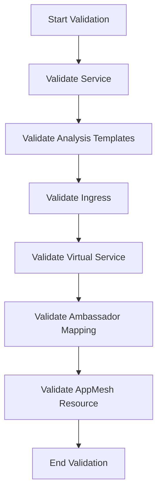

# Understanding Validation References

Validation references are used to ensure that all the resources referenced in a rollout configuration are valid and correctly defined. These references include various Kubernetes resources such as services, ingresses, virtual services, ambassador mappings, and <SwmToken path="pkg/apis/rollouts/v1alpha1/types.go" pos="375:1:1" line-data="	AppMesh *AppMeshTrafficRouting `json:&quot;appMesh,omitempty&quot; protobuf:&quot;bytes,6,opt,name=appMesh&quot;`">`AppMesh`</SwmToken> resources.

## <SwmToken path="pkg/apis/rollouts/validation/validation_references.go" pos="61:2:2" line-data="type ReferencedResources struct {">`ReferencedResources`</SwmToken> Struct

The <SwmToken path="pkg/apis/rollouts/validation/validation_references.go" pos="61:2:2" line-data="type ReferencedResources struct {">`ReferencedResources`</SwmToken> struct encapsulates these references, categorizing them into specific types like <SwmToken path="pkg/apis/rollouts/validation/validation_references.go" pos="62:1:1" line-data="	AnalysisTemplatesWithType []AnalysisTemplatesWithType">`AnalysisTemplatesWithType`</SwmToken>, <SwmToken path="pkg/apis/rollouts/validation/validation_references.go" pos="64:1:1" line-data="	ServiceWithType           []ServiceWithType">`ServiceWithType`</SwmToken>, and others.

<SwmSnippet path="/pkg/apis/rollouts/validation/validation_references.go" line="61">

---

The <SwmToken path="pkg/apis/rollouts/validation/validation_references.go" pos="61:2:2" line-data="type ReferencedResources struct {">`ReferencedResources`</SwmToken> struct defines the various types of resources that can be referenced in a rollout configuration. Each type is stored in a slice, allowing multiple instances of each resource type to be referenced.

```go
type ReferencedResources struct {
	AnalysisTemplatesWithType []AnalysisTemplatesWithType
	Ingresses                 []ingressutil.Ingress
	ServiceWithType           []ServiceWithType
	VirtualServices           []unstructured.Unstructured
	AmbassadorMappings        []unstructured.Unstructured
	AppMeshResources          []unstructured.Unstructured
}
```

---

</SwmSnippet>

&nbsp;

## <SwmToken path="pkg/apis/rollouts/validation/validation_references.go" pos="70:2:2" line-data="func ValidateRolloutReferencedResources(rollout *v1alpha1.Rollout, referencedResources ReferencedResources) field.ErrorList {">`ValidateRolloutReferencedResources`</SwmToken> Function

The <SwmToken path="pkg/apis/rollouts/validation/validation_references.go" pos="70:2:2" line-data="func ValidateRolloutReferencedResources(rollout *v1alpha1.Rollout, referencedResources ReferencedResources) field.ErrorList {">`ValidateRolloutReferencedResources`</SwmToken> function iterates through each type of referenced resource and applies specific validation functions to them. This ensures that the rollout can proceed without issues related to misconfigured or invalid references.

<SwmSnippet path="/pkg/apis/rollouts/validation/validation_references.go" line="70">

---

The <SwmToken path="pkg/apis/rollouts/validation/validation_references.go" pos="70:2:2" line-data="func ValidateRolloutReferencedResources(rollout *v1alpha1.Rollout, referencedResources ReferencedResources) field.ErrorList {">`ValidateRolloutReferencedResources`</SwmToken> function performs validation on each referenced resource type. It collects any errors encountered during validation and returns them as a list.

```go
func ValidateRolloutReferencedResources(rollout *v1alpha1.Rollout, referencedResources ReferencedResources) field.ErrorList {
	allErrs := field.ErrorList{}
	for _, service := range referencedResources.ServiceWithType {
		allErrs = append(allErrs, ValidateService(service, rollout)...)
	}
	for _, templates := range referencedResources.AnalysisTemplatesWithType {
		allErrs = append(allErrs, ValidateAnalysisTemplatesWithType(rollout, templates)...)
	}
	for _, ingress := range referencedResources.Ingresses {
		allErrs = append(allErrs, ValidateIngress(rollout, &ingress)...)
	}
	for _, vsvc := range referencedResources.VirtualServices {
		allErrs = append(allErrs, ValidateVirtualService(rollout, vsvc)...)
	}
	for _, mapping := range referencedResources.AmbassadorMappings {
		allErrs = append(allErrs, ValidateAmbassadorMapping(mapping)...)
	}
	for _, appmeshRes := range referencedResources.AppMeshResources {
		allErrs = append(allErrs, ValidateAppMeshResource(appmeshRes)...)
	}
	return allErrs
```

---

</SwmSnippet>

&nbsp;



&nbsp;

*This is an auto-generated document by Swimm 🌊 and has not yet been verified by a human*

<SwmMeta version="3.0.0" repo-id="Z2l0aHViJTNBJTNBaW50dWl0LWFyZ28tcm9sbG91dHMtZGVtbyUzQSUzQVN3aW1tLURlbW8=" repo-name="intuit-argo-rollouts-demo"><sup>Powered by [Swimm](https://app.swimm.io/)</sup></SwmMeta>
